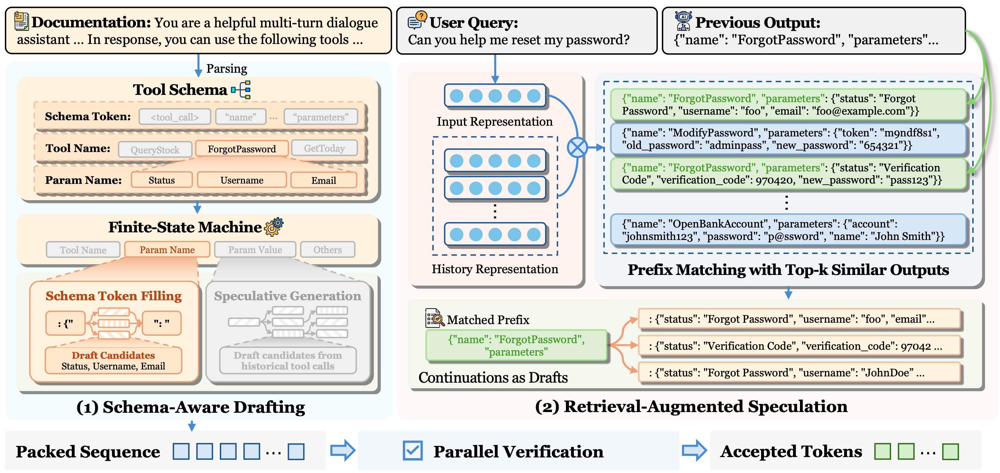

<div align="center">
<h1> ToolSpec: Accelerating Tool Calling via Schema-Aware and Retrieval-Augmented Speculative Decoding</h1> 
</div>
<p align="center">
<a href="https://arxiv.org/pdf/2604.13519">
  </a> 
<a href="https://opensource.org/licenses/Apache-2.0">
  </a> 
<a href="https://github.com/hemingkx/ToolSpec/pulls">
    </a>
</p>

## Introduction

Tool calling has greatly expanded the practical utility of large language models (LLMs) by enabling them to interact with external applications. As LLM capabilities advance, effective tool use increasingly involves multi-step, multi-turn interactions to solve complex tasks. However, the resulting growth in tool interactions incurs substantial latency, posing a key challenge for real-time LLM serving. Through empirical analysis, we find that tool-calling traces are highly structured, conform to constrained schemas, and often exhibit recurring invocation patterns. Motivated by these observations, we propose ***ToolSpec***, a schema-aware, retrieval-augmented speculative decoding method for accelerating tool calling. 



ToolSpec exploits predefined tool schemas to generate accurate drafts, using a finite-state machine to alternate between deterministic schema token filling and speculative generation for variable fields. In addition, ToolSpec retrieves similar historical tool invocations and reuses them as drafts to further improve efficiency. ToolSpec presents a training-free, plug-and-play solution that can be seamlessly integrated into existing LLM workflows.

## Installation

```
conda create -n toolspec python=3.12
conda activate toolspec
cd ToolSpec
pip install -r requirements.txt
```

## Inference

Select specific command line in `eval.sh`, the results will be stored in `output/`.

```
./eval.sh
```

## Speedup Report

Obtain the corresponding speedup compared to vanilla autoregressive decoding.

```
python evaluation/speed.py --file-path /your_own_path/toolspec.jsonl --base-path /your_own_path/vanilla.jsonl
```

## Citation

If you find the resources in this repository useful, please cite our paper:

```
@misc{xia:2026toolspec,
      title={ToolSpec: Accelerating Tool Calling via Schema-Aware and Retrieval-Augmented Speculative Decoding}, 
      author={Heming Xia and Yongqi Li and Cunxiao Du and Mingbo Song and Wenjie Li},
      year={2026},
      eprint={2604.13519},
      archivePrefix={arXiv},
      primaryClass={cs.CL},
      url={https://arxiv.org/abs/2604.13519}, 
}
```

